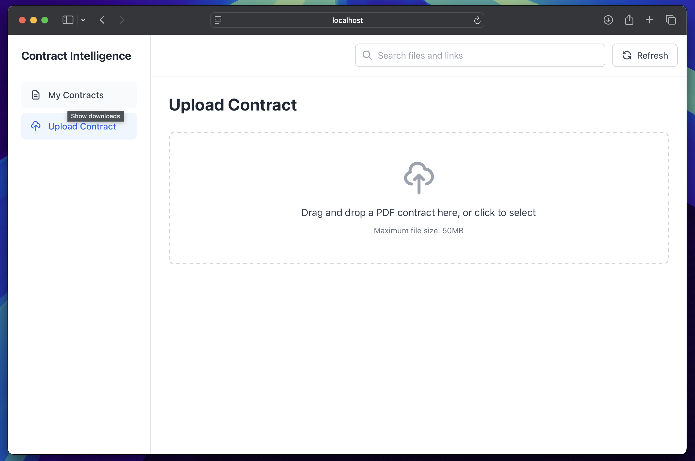
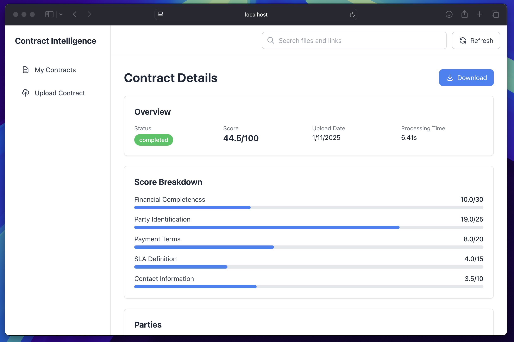
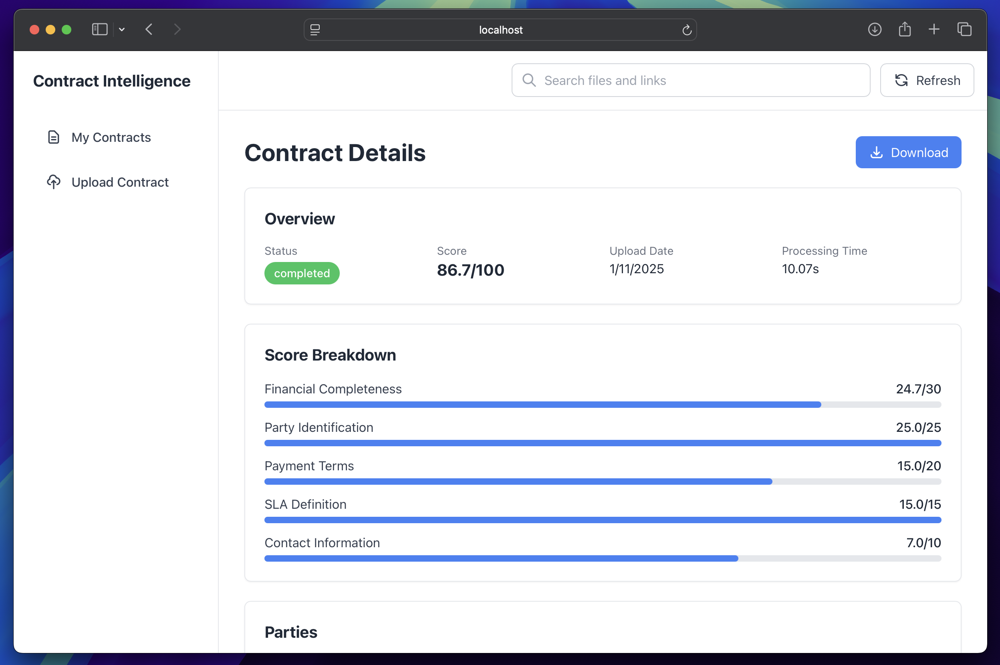
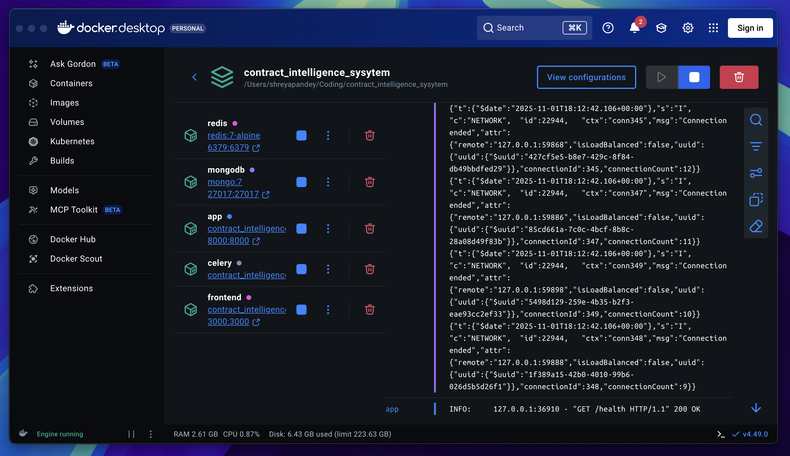

# Contract Intelligence System

An automated contract intelligence system for accounts receivable SaaS platforms. This system processes PDF contracts, extracts critical financial and operational data using LLM-powered parsing, and provides completeness scores with gap analysis.

## System Architecture

The system consists of multiple services running in Docker containers:

### Backend Services

- **FastAPI Application**: Main REST API server that handles file uploads, status queries, and contract data retrieval
- **Celery Worker**: Background task processor that handles contract parsing and scoring
- **MongoDB**: NoSQL database storing contract metadata and extracted data
- **Redis**: Message broker and result backend for Celery tasks

### Frontend Service

- **Next.js Application**: React-based web interface for uploading contracts and viewing results

### External Services

- **OpenRouter API**: Provides access to multiple LLM models (Claude, GPT-4, etc.) for contract parsing

### Technology Stack

- **Backend Framework**: FastAPI (Python 3.11)
- **Database**: MongoDB 7
- **Message Broker**: Redis 7
- **Task Queue**: Celery 5.3
- **Frontend**: Next.js with TypeScript
- **Containerization**: Docker and Docker Compose

### Service Communication

The application service and Celery worker both connect to MongoDB and Redis using Docker service names (`mongodb` and `redis`) rather than localhost. The Celery worker establishes a separate MongoDB connection when it starts via the `worker_ready` signal handler, as it runs in a separate container and cannot share the FastAPI application's connection pool.

Both services wait for MongoDB and Redis to pass health checks before starting, ensuring dependencies are ready.

## Project Structure

```
contract_intelligence_sysytem/
├── app/                          # Backend application
│   ├── __init__.py
│   ├── main.py                   # FastAPI application entry point
│   │                             # - Initializes FastAPI app
│   │                             # - Configures CORS middleware
│   │                             # - Defines lifespan handlers
│   │                             # - Includes route handlers
│   │                             # - Provides health check endpoints
│   ├── config.py                 # Configuration and settings
│   │                             # - Loads environment variables
│   │                             # - Defines Pydantic Settings class
│   │                             # - Provides cached settings instance
│   ├── database.py               # MongoDB connection management
│   │                             # - Establishes and manages connections
│   │                             # - Creates database indexes
│   │                             # - Provides database access functions
│   ├── models.py                 # Pydantic data models
│   │                             # - Defines contract data structures
│   │                             # - Processing status enums
│   ├── schemas.py                # API request/response schemas
│   │                             # - Request validation schemas
│   │                             # - Response models
│   ├── routes/                   # API route handlers
│   │   ├── __init__.py
│   │   └── contracts.py         # Contract-related endpoints
│   │                             # - POST /contracts/upload
│   │                             # - GET /contracts/{id}
│   │                             # - GET /contracts/{id}/status
│   │                             # - GET /contracts/{id}/download
│   │                             # - GET /contracts (list with filters)
│   ├── services/                 # Business logic services
│   │   ├── __init__.py
│   │   ├── parser.py            # Contract parsing service
│   │   │                         # - Extracts text from PDFs
│   │   │                         # - Calls OpenRouter API
│   │   │                         # - Parses LLM responses
│   │   ├── scoring.py           # Scoring calculation service
│   │   │                         # - Calculates completeness scores
│   │   │                         # - Identifies missing fields
│   │   │                         # - Provides score breakdowns
│   │   └── storage.py           # File storage service
│   │                             # - Handles file uploads
│   │                             # - Manages file storage paths
│   │                             # - Validates file types and sizes
│   └── tasks/                    # Celery background tasks
│       ├── __init__.py
│       └── celery_tasks.py      # Contract processing tasks
│                                 # - Defines Celery app
│                                 # - Worker lifecycle signals
│                                 # - Async contract processing task
│                                 # - Error handling and retries
├── frontend/                     # Next.js frontend application
│   ├── app/                     # Next.js app directory
│   │   ├── page.tsx             # Home page with contract list
│   │   ├── upload/              # Upload page
│   │   │   └── page.tsx         # Contract upload interface
│   │   └── contracts/           # Contract detail pages
│   │       └── [id]/
│   │           └── page.tsx     # Individual contract details
│   ├── components/              # React components
│   │   ├── ContractCard.tsx     # Contract list item component
│   │   ├── Header.tsx           # Application header
│   │   └── Sidebar.tsx          # Navigation sidebar
│   ├── Dockerfile               # Frontend Docker image
│   └── package.json             # Node.js dependencies
├── uploads/                     # Uploaded contract files (gitignored)
├── docker-compose.yml           # Docker services configuration
│                                 # - MongoDB service with health checks
│                                 # - Redis service with health checks
│                                 # - Application service configuration
│                                 # - Celery worker service configuration
│                                 # - Frontend service configuration
│                                 # - Volume definitions
├── Dockerfile                   # Backend Docker image
│                                 # - Python 3.11 slim base
│                                 # - System dependencies for PDF processing
│                                 # - Application code installation
│                                 # - Health check configuration
├── requirements.txt             # Python dependencies
├── .gitignore                  # Git ignore rules
└── README.md                   # This file
```

### Key Files Explained

**app/main.py**: FastAPI application initialization. Sets up routes, middleware, and lifespan handlers for database connections.

**app/config.py**: Centralized configuration using Pydantic Settings. Loads from environment variables and .env file. Provides cached settings instance.

**app/database.py**: MongoDB connection management. Handles connection lifecycle, creates indexes, and provides database access functions. Called during application startup and in Celery worker.

**app/routes/contracts.py**: REST API endpoints for contract operations. Handles file uploads, status checks, data retrieval, and file downloads.

**app/services/parser.py**: Contract parsing service. Extracts text from PDFs using pdfplumber and PyPDF2, sends to OpenRouter API for structured data extraction.

**app/services/scoring.py**: Completeness scoring service. Calculates weighted scores (0-100) based on presence of critical fields like financial details, party information, payment terms, SLAs, and contact information.

**app/tasks/celery_tasks.py**: Celery task definitions and worker configuration. Includes worker_ready and worker_shutdown signal handlers for MongoDB connection management. Defines the main contract processing task with error handling and retries.

**docker-compose.yml**: Defines all Docker services, their dependencies, health checks, environment variables, and volume mounts. Ensures proper service startup order using health check conditions.

## Quick Start

### Prerequisites

- Docker Engine 20.10 or later
- Docker Compose 2.0 or later
- OpenRouter API key (get one at https://openrouter.ai)

### Run Everything with Docker

**Main command to start all services:**

```bash
docker-compose up --build
```

Or run in background (detached mode):

```bash
docker-compose up --build -d
```

This single command will:
- Build Docker images for backend and frontend
- Pull MongoDB and Redis images
- Start all 5 services (mongodb, redis, app, celery, frontend)
- Wait for dependencies to be healthy
- Make everything available at the configured ports

### Setup Steps

1. **Clone the repository**
   ```bash
   git clone https://github.com/shreyap2702/contract_intelligence_system
   cd contract_intelligence_sysytem
   ```

2. **Copy `.env.example` file** as `.env` and edit the following lines:
   ```bash
   //For copying the file
   cp .env.example .env

   // Now edit the following lines:
   OPENROUTER_API_KEY=your_openrouter_api_key_here
   OPENROUTER_MODEL=anthropic/claude-3.5-sonnet
   ```
   
   Replace `your_openrouter_api_key_here` with your actual OpenRouter API key.

3. **Run the Docker command:**
   ```bash
   docker-compose up --build
   ```

4. **Access the application**
   - API: http://localhost:8000
   - API Docs: http://localhost:8000/docs
   - Frontend: http://localhost:3000
   - Health Check: http://localhost:8000/health

5. **Verify all services are running:**
   ```bash
   docker-compose ps
   ```

All services should show as "Up" or "healthy".

## Environment Variables

**Required:**
- `OPENROUTER_API_KEY`: Your OpenRouter API key (required for contract parsing)

**Optional:**
- `MONGODB_URL`: MongoDB connection string (default: `mongodb://localhost:27017`)
- `REDIS_URL`: Redis connection string (default: `redis://localhost:6379/0`)
- `CELERY_BROKER_URL`: Celery broker URL (default: `redis://localhost:6379/0`)
- `CELERY_RESULT_BACKEND`: Celery result backend URL (default: `redis://localhost:6379/0`)
- `OPENROUTER_MODEL`: Model to use for parsing (default: `anthropic/claude-3.5-sonnet`)

In Docker, the compose file automatically sets these to use Docker service names (`mongodb://mongodb:27017`, `redis://redis:6379/0`).

## Screenshots

Below are sample views from the frontend dashboard and Docker environment.

### Dashboard Views

<p align="center">
   <br>
   <br>
   <br>
  
</p>

### Docker Dashboard

<p align="center">
  
</p>

